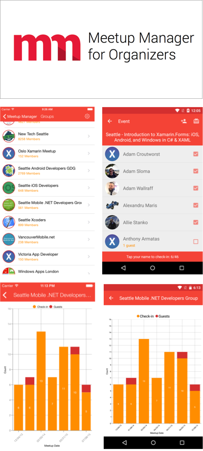

Meetup Manager for Organizers
===========

A Cross-Platform app for Meetup.com organizers to help track attendees at events.

Written in C# with ([Xamarin](http://www.xamarin.com)) 

Open Source Project by ([@JamesMontemagno](http://www.twitter.com/jamesmontemagno)) 

Copyright 2015 ([Refractored LLC](http://www.refractored.com))

## Available for free on:
* Android: Available on [Google Play](https://play.google.com/store/apps/details?id=com.refractored.meetupmanager)
* iPhone: Available on [App Store](https://itunes.apple.com/us/app/meetup-manager-for-organizers/id796213890?ls=1&mt=8)
* Windows Phone 8: Available on [Windows Phone Marketplace](http://www.windowsphone.com/en-us/store/app/meetup-manager-for-organizers/38ef03e9-3dfe-4150-b797-5ec9ed81b8cd)

Built with C# 6 features, you must be running VS 2015 or Xamarin Studio to compile. 

## Why did I create this?
As a user group organizer of ([Seattle Mobile .NET Developers Group](http://www.meetup.com/SeattleMobileDevelopers/)) I found our right away that there was an issue with finding out not only how many people attended the event but also who was there. I thought that there had to be a better way of checking people in at the door and the using this data to do giveaways as well. After realizing that Meetup.com had a great restful API that I could tap into I spent my holiday break between Dec 24th and Dec 30th 2013 to create Meetup Manager v1 using MVVMCross. 

Since then Meetup Manager has evolved and has been optimized. You can now easily visualize your groups performance over time with beautiful charts and at the start of August 2015 I completely re-wrote Meetup Manager using Xamarin.Forms to create a shared user interface and also give it a huge refresh.

## How much code is shared?
I have included an "Analysis Project", which will count the shared lines of code. 95%+ of the code is shared between projects. All of the Models, Services, View Models, Views, and tons of helper classes are all found in one single PCL library. 

## How you can test it. 

Simply download the app from the app store or download the code and run! It is that simple as I have provided sample API keys to get you going.

### Enabling Xamarin.UITest

To run UITest you will need to provide a test account email and password. Simply open up MeetupManager.UITests/Tests.cs and enter your username and password.

### Enabling Syncfusion Charts

By default I have commented out the Syncfusion Charts as you will need to either start a free trial or purchase Syncfusion Essential Studio for all sorts of awesome controls. To get started simply download a trial from our component store: https://components.xamarin.com/view/syncfusionessentialstudio

After downloading the Component, you will want to ensure the following references have been added to each project, and add a bit of initialization code.

#### iOS

* lib/ios-unified/Syncfusion.SfChart.iOS.dll
* lib/ios-unified/Syncfusion.SfChart.XForms.dll
* lib/ios-unified/Syncfusion.SfChart.XForms.iOS.dll

In the AppDelegate.cs after Forms.Init(); add new SfChartRenderer();

#### Android

* lib/android/Syncfusion.SfChart.Android.dll
* lib/android/Syncfusion.SfChart.XForms.dll
* lib/android/Syncfusion.SfChart.XForms.Android.dll

In the MainActivity.cs after Forms.Init (this, bundle); add new SfChartRenderer();.

#### Portable Class Library

* lib/pcl/Syncfusion.SfChart.XForms.dll

Open up Views/Statistics.xaml and comment back in the chart. Open Views/Statistics.xaml.cs and comment back in the Chart code to set the zoom level.

## What technology is used?
Everything is written in C# with Xamarin with a base PCL library. This project couldn't have been done without the following:

### Xamarin.Forms 
http://www.xamarin.com/forms: Use the Xamarin.Forms API to quickly build native apps for iOS, Android and Windows completely in C#.

### Settings Plugin for Xamarin and Windows
https://github.com/jamesmontemagno/xamarin.plugins - I wrote this, so you should probably use it for cross platform settings :)

### Image Circle for Xamarin.Forms
https://github.com/jamesmontemagno/xamarin.plugins - I wrote this, so you should probably use it for beautiful circle images!

### Json.NET
https://components.xamarin.com/view/json.net - I use both the NuGet in the PCL and component for iOS for facade linking. One of the most wonderful Json libraries that I simply love. It is used to deserialize all information coming from the meetup.com APIs.

### Xamarin.Auth
https://components.xamarin.com/view/xamarin.auth - Allowed me to integrate in oAuth 2.0 from Meetup.com in under 1 hour. 

### Discreet Notifications
https://components.xamarin.com/view/gcdiscreetnotification - Bringing toast notifications to iOS

### Modern HttpClient
https://components.xamarin.com/view/modernhttpclient- Faster apps with a faster httpclient handler!

### Xamarin Insights
http://xamarin.com/insights - Add real-time monitoring with precise, detailed error reporting to your apps in a single line of code.

### SQLite-Net PCL
https://www.nuget.org/packages/sqlite-net-pcl/ - SQLite in your PCL and .NET by my good friend Frank Krueger

## License
The MIT License (MIT)

Copyright (c) 2015 Refractored LLC / James Montemagno

Permission is hereby granted, free of charge, to any person obtaining a copy of
this software and associated documentation files (the "Software"), to deal in
the Software without restriction, including without limitation the rights to
use, copy, modify, merge, publish, distribute, sublicense, and/or sell copies of
the Software, and to permit persons to whom the Software is furnished to do so,
subject to the following conditions:

The above copyright notice and this permission notice shall be included in all
copies or substantial portions of the Software.

THE SOFTWARE IS PROVIDED "AS IS", WITHOUT WARRANTY OF ANY KIND, EXPRESS OR
IMPLIED, INCLUDING BUT NOT LIMITED TO THE WARRANTIES OF MERCHANTABILITY, FITNESS
FOR A PARTICULAR PURPOSE AND NONINFRINGEMENT. IN NO EVENT SHALL THE AUTHORS OR
COPYRIGHT HOLDERS BE LIABLE FOR ANY CLAIM, DAMAGES OR OTHER LIABILITY, WHETHER
IN AN ACTION OF CONTRACT, TORT OR OTHERWISE, ARISING FROM, OUT OF OR IN
CONNECTION WITH THE SOFTWARE OR THE USE OR OTHER DEALINGS IN THE SOFTWARE.
